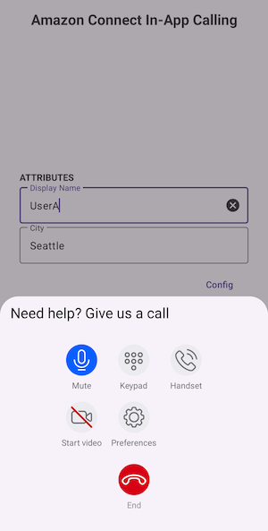

# Amazon Connect In-App Calling Sample – Android

This sample Android app demonstrates how to interact with Amazon Connect APIs to start an **in-app voice/video call** and send **DTMF**. It also supports **screen sharing** via Amazon Chime SDK.

This app works together with the serverless solution provided by the [`Amazon Connect In-App Calling API Sample`](https://github.com/amazon-connect/amazon-connect-in-app-calling-examples/tree/main/Backend/AmazonConnectNetraApiSample).  
➡️ **Please deploy the backend first and take note of the endpoint outputs.**


---

## 📱 Preview



---

## 🚀 Setup

1. **Deploy the Backend**  
   Follow the [Amazon Connect In-App Calling API Sample](https://github.com/amazon-connect/amazon-connect-in-app-calling-examples/tree/main/Backend/AmazonConnectNetraApiSample) README to deploy the Lambda-based APIs via AWS CDK.

2. **Clone this repo**

   ```bash
   git clone https://github.com/amazon-connect/amazon-connect-in-app-calling-examples.git
   cd Android/AmazonConnectInAppCallingAndroidSample
   ```

3. **Configure Android SDK**
   - Open in [Android Studio](https://developer.android.com/studio)
   - Ensure Android SDK path is set:
      - File → Project Structure → SDK Location
      - Or edit local.properties:
        ```properties
        sdk.dir=/your/android/sdk/path
        ```

4. **Provide Required Configuration**  
   Add the following entries in your local.properties file:
    ```properties
    connect.instanceId=your-connect-instance-id
    connect.contactFlowId=your-contact-flow-id
    endpoints.startWebRTC=https://your-start-webrtc-endpoint/
    endpoints.createParticipant=https://your-create-participant-endpoint/
    endpoints.sendMessage=https://your-send-message-endpoint/
    ```
   These values are used as default and can be changed in the app’s Configuration dialog at runtime.

5. **Run the App**
   - Connect a physical Android device
   - Hit ▶️ Run in Android Studio and target the app

6. **Start a Call**
   - Enter your Display Name and City
   - Tap Start Call to initiate
   - Click **Config** button to update endpoints if needed

## 🧩 Key Components

| Component               | File / Class Name                      | Responsibility                                                               |
|------------------------|----------------------------------------|-------------------------------------------------------------------------------|
| Call Sheet             | `CallSheet.kt`                         | Main UI sheet that shows during an active call                                |
| Call Manager           | `CallManager.kt`                       | Manages the call session, audio/video state, DTMF, and participants events    |
| Call Connection  | `CallConnection.kt`         | Bridges the in-app call with Android Telecom. Manages call audio routing changes (e.g. Bluetooth, speaker), and handles system-level disconnects or conflicts with other ongoing calls. |
| Screen Share Manager   | `ScreenShareManager.kt`                | Manages screen capture and sharing                                            |
| Configuration Repository | `ConfigRepository.kt`                | Central source for retrieving call-related configuration used to start calls  |

## ✅ Features
- In-app audio/video calling with Amazon Connect
- Dynamic contact attributes (e.g., name and city)
- DTMF (dual-tone signaling)
- Screen sharing
- Video background blur
- Voice focus

